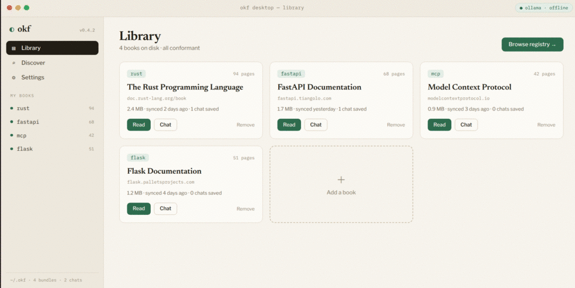

# okf desktop

[](https://github.com/vinodborole/okf-desktop/releases/latest)
[](https://github.com/vinodborole/okf-desktop/releases)
[](https://github.com/vinodborole/okf-desktop/actions/workflows/release.yml)

[](https://github.com/vinodborole/okf-kit)
[](LICENSE)

A lightweight desktop app for [okf-kit](https://github.com/vinodborole/okf-kit):
browse the registry, install "books" (OKF bundles), read them like a book, and
chat with them (offline or with your own LLM) — with cited answers that jump
straight to the source section.

<p align="center">
  
</p>

**It contains no okf-kit logic.** The UI is pure React over okf-kit's local API
(`okf serve`, shipped in okf-kit 0.3.0). The shell just launches that server and
opens a window. Update okf-kit and the app gets the changes for free.

## Download

Prebuilt bundles for **Linux, macOS, and Windows** are on the
**[Releases](https://github.com/vinodborole/okf-desktop/releases/latest)** page —
no Python/Node/pip needed. Each is built automatically by CI on its own platform.

```bash
# Linux (x64)
tar -xzf okf-desktop-linux-x64.tar.gz && ./okf-desktop/okf-desktop
```

macOS and Windows builds are **unsigned** (no code-signing certificate yet), so the
OS warns on first launch:

- **macOS** — unzip to get `okf-desktop.app`. Because it's downloaded + unsigned,
  Gatekeeper may say it's "damaged." It isn't — that's the quarantine flag. Clear it:
  ```bash
  xattr -dr com.apple.quarantine ~/Downloads/okf-desktop.app
  open ~/Downloads/okf-desktop.app
  ```
  (Or: **System Settings → Privacy & Security → Open Anyway**.)
- **Windows** — unzip and run `okf-desktop\okf-desktop.exe`; SmartScreen → **More
  info → Run anyway**.
- **Linux** — needs system GTK 3 + WebKit2GTK (standard on most desktops).

```
okf-desktop/
├─ ui/            React + Vite — the 5 screens (Library, Discover, Read, Chat, Settings)
│  └─ src/api.js  the only integration point: fetch() against the okf serve API
└─ shell/         pywebview launcher (spawns `okf serve`, opens the window)
```

## Architecture

```
pywebview window ──► React UI ──fetch/SSE──► okf serve (okf-kit) ──► ~/.okf + OS keychain
        └── spawns `okf serve --ui ui/dist` and opens it with the per-launch token
```

`okf serve` hosts the built UI at `/` and the API at `/api`, so it's a single
origin with no CORS. The shell passes the bearer token to the page via `?token=`.

## Run it

Prereqs: **Node 18+** and **Python 3.10+**.

```bash
# 1. build the UI
cd ui && npm install && npm run build && cd ..

# 2. install the shell deps (okf-kit[serve] + pywebview) — a venv is fine
pip install -r shell/requirements.txt      # Linux: also `pip install pywebview[qt]`

# 3. launch
python shell/app.py
```

First run: the Library is empty — click **Browse registry → Discover**, hit
**get** on a book, then **Read** or **Chat**.

## Develop the UI (hot reload)

The build-then-serve flow above is the reliable path. For fast UI iteration you
can point the shell at the Vite dev server instead — this needs okf serve to
allow the dev origin (a small CORS addition to okf-kit, tracked as a follow-up).

## What's wired

All five screens talk to the live API:

| Screen | Endpoints |
|---|---|
| Library | `GET /api/books`, `DELETE /api/books/{name}`, `GET /api/status` |
| Discover | `GET /api/registry`, `POST /api/books/{name}/install` (SSE) |
| Read | `GET …/toc`, `GET …/concept` (markdown + heading anchors) |
| Chat | chats CRUD, `POST …/ask` (SSE) — citation chips deep-link into Read |
| Settings | `GET/PUT /api/settings` (key in the OS keychain) |

## Package a distributable (PyInstaller)

Freeze the app + the in-process API + the built UI into one self-contained
bundle. Run this **on each target OS** — PyInstaller does not cross-compile.

```bash
./build.sh
# -> dist/okf-desktop/okf-desktop        (the executable)
# -> dist/okf-desktop-linux-x64.tar.gz   (ship this)
```

How it works: the frozen app runs `okf serve` **in-process on a thread** (no
subprocess), serving the bundled `ui/dist` + API on a random loopback port, then
opens the pywebview window at it. The crawl stack and other unused deps are
excluded, so the Linux bundle is ~140 MB (mostly GTK + ICU + Python).

Platform notes:
- **Linux** uses the system **GTK3 + WebKit2GTK** (present on typical desktops),
  exactly as pywebview does when run normally — those aren't bundled.
- **macOS** (WKWebView) and **Windows** (Edge WebView2) freeze more self-contained.
- **Signing/notarizing** for public distribution (Apple notarization, Windows code
  cert) is separate and required to avoid Gatekeeper/SmartScreen warnings.

## Notes / follow-ups

- **Fonts** (Newsreader / Libre Franklin / IBM Plex Mono) are **self-hosted** via
  [@fontsource](https://fontsource.org) (imported in `main.jsx`), so Vite bundles
  the woff2s into `dist` — no network, works fully offline.
- **Packaging** into signed installers is done via PyInstaller (`build.sh` +
  `okf-desktop.spec`); signing/notarization for public distribution is a separate
  step.
- **True token streaming** in Chat is a v1 okf-kit change (the API currently
  chunks the finished answer); the UI already renders it token-by-token.

## License

Copyright © 2026 Vinod Borole. All rights reserved.

**okf desktop is licensed under the [GNU Affero General Public License v3.0](LICENSE) (AGPL-3.0).**

In short: you're free to use, study, and modify it — but if you distribute it, or
run a modified version as a network/hosted service, you must release your complete
source under AGPL-3.0 as well. This keeps the project (and any derivative) open;
it cannot be taken closed-source or repackaged into a proprietary product.

It builds on permissively-licensed components — [okf-kit](https://github.com/vinodborole/okf-kit)
(Apache-2.0), React and markdown-it (MIT), and the Newsreader / Libre Franklin /
IBM Plex Mono fonts (OFL/MIT) — each under its own license.
